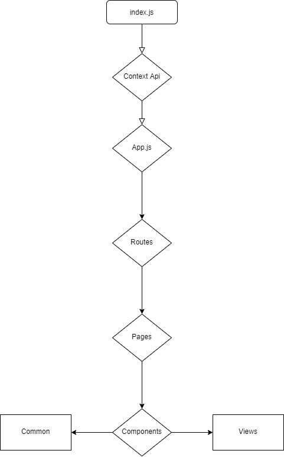

# Technical Test | Platzi Master [C8] 💚

Construction of application to validate technical knowledge.
## Demo 🚀

[View Demo](https://yadurani.github.io/platzi-c8/)

## Tools 🚀

- React.js
- Styled Components
- Firebase

## Installation  🛴

Clone app

```bash
git clone https://github.com/yadurani/platzi-c8.git
```

Install dependencies

```bash
yarn install 'or' npm install
```

Corra el proyecto

```bash
yarn start 'or' npm run start
```

## Flowchart 🔖

